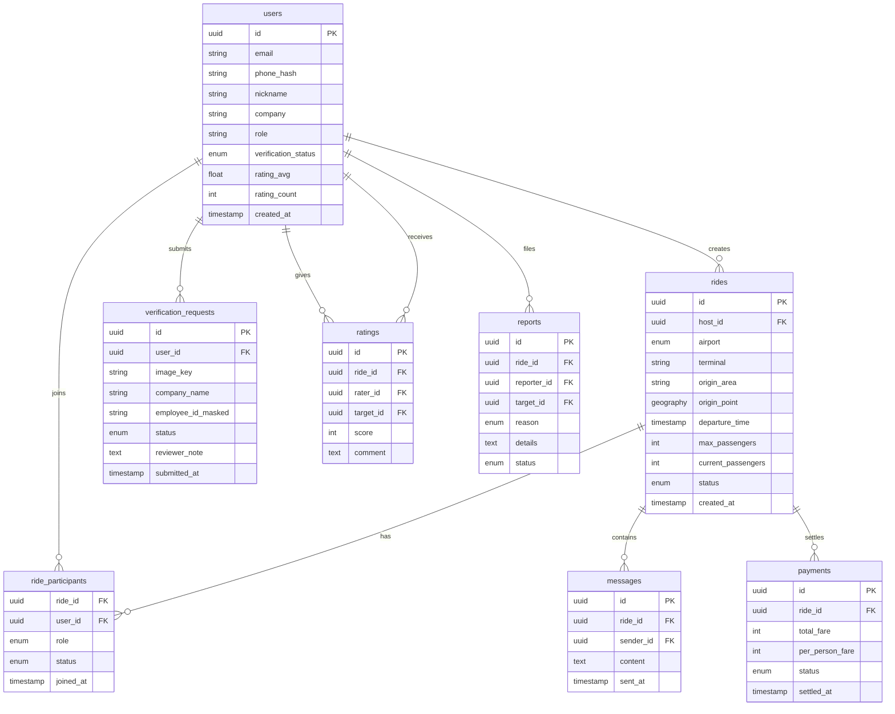
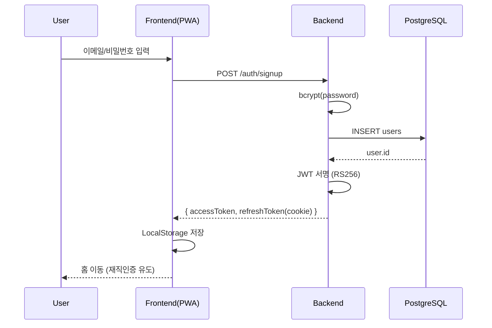
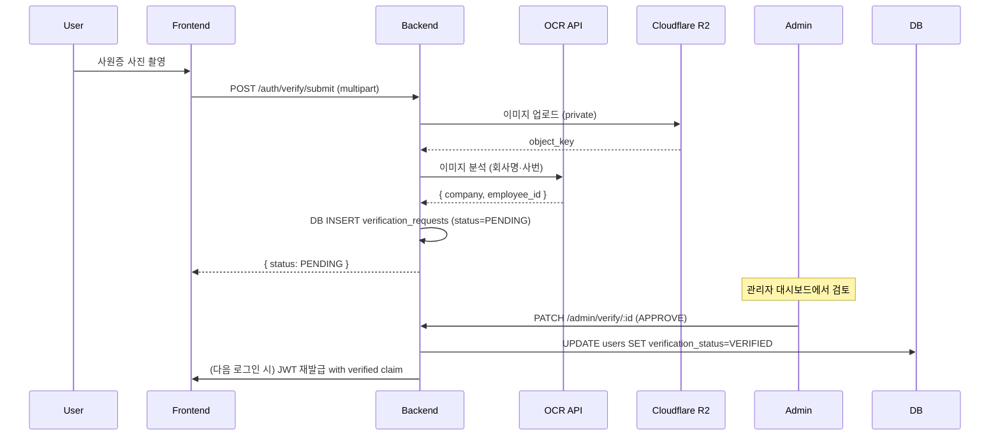

# 에어풀(AirPool) 기술 아키텍처 문서

> **문서 버전**: v1.0 · 2026-04
> **대상 독자**: 개발팀, 외부 기술 검토자, CTO 후보

---

## 1. 시스템 개요

에어풀은 **PWA 프론트엔드 + Node.js REST API + PostgreSQL + 실시간 채팅(SSE)** 구조의 모놀리식 MVP로 시작, MAU 성장에 따라 모듈별 분리(matching service, chat service, payment service)하는 **단계적 마이크로서비스화** 전략을 따릅니다.

### 1.1 전체 구성도 (ASCII)

```
 ┌────────────────────────────────────────────────────────────┐
 │                      사용자 디바이스                        │
 │  ┌──────────────┐  ┌──────────────┐  ┌──────────────────┐  │
 │  │   PWA (iOS)  │  │ PWA(Android) │  │   React Native   │  │
 │  │              │  │              │  │   (Phase 2)      │  │
 │  └──────┬───────┘  └──────┬───────┘  └────────┬─────────┘  │
 └─────────┼─────────────────┼───────────────────┼───────────┘
           │                 │                   │
           └─────────┬───────┴────────┬──────────┘
                     │ HTTPS          │ WSS (채팅)
           ┌─────────▼────────────────▼───────────┐
           │         Vercel Edge (Frontend)        │
           │  - SSR/CDN, PWA manifest, 정적 자산   │
           └────────────────┬──────────────────────┘
                            │ REST / SSE
           ┌────────────────▼──────────────────────┐
           │      Railway / Fly.io (Backend)       │
           │   Node.js + Express + Socket.io       │
           │   ┌──────────────────────────────┐    │
           │   │  Auth   Match   Chat  Payment│    │
           │   │  Module Engine  Hub   Module │    │
           │   └──────────────────────────────┘    │
           └─────┬──────────────┬─────────────┬────┘
                 │              │             │
      ┌──────────▼──┐  ┌────────▼────┐  ┌────▼──────────┐
      │ PostgreSQL  │  │   Redis     │  │ Cloudflare R2 │
      │ (primary)   │  │ (캐시/세션) │  │ (인증이미지)  │
      └─────────────┘  └─────────────┘  └───────────────┘
                 │
      ┌──────────▼──────────┐
      │  외부 연동(Optional) │
      │  - 카카오T API       │
      │  - 토스페이먼츠      │
      │  - OCR(Upstage/AWS)  │
      │  - Sentry / Plausible│
      └─────────────────────┘
```

---

## 2. 기술 스택 선정 근거

### 2.1 Frontend

| 항목 | MVP 선택 | 확장 시 | 근거 |
|---|---|---|---|
| 언어 | Vanilla JS + HTML/CSS | TypeScript | 초기 속도, 이후 타입 안전성 |
| 프레임워크 | 없음 (PWA) | React Native | 앱스토어 배포 준비 후 전환 |
| 빌드 | 없음 (정적) | Vite | 번들 최적화 |
| 스타일 | 순수 CSS | Tailwind CSS | 디자인 시스템 전환 시 |
| 상태관리 | LocalStorage | Zustand / Redux Toolkit | 복잡도 증가 시 |

**선정 이유**: MVP 단계는 **설치 마찰 제거**가 최우선. PWA는 설치 없이 브라우저에서 동작하며 iOS/Android 양쪽 지원. MAU 10,000 돌파 후 푸시 알림·백그라운드 위치 공유 등 네이티브 기능 필요 시 React Native로 전환.

### 2.2 Backend

| 항목 | MVP 선택 | 확장 시 |
|---|---|---|
| 언어 | Node.js (v20 LTS) | 동일 |
| 프레임워크 | Express | Fastify 또는 NestJS |
| ORM | better-sqlite3 (raw SQL) | Prisma |
| 인증 | JWT (RS256) | JWT + Refresh Token Rotation |
| 파일 처리 | multer | multer + Cloudflare Worker |

**선정 이유**: Node.js는 **실시간 통신·I/O 병목에 강점**, 한국 개발자 풀 풍부. Express는 러닝커브 낮아 MVP 적합.

### 2.3 Database

| 단계 | DB | 이유 |
|---|---|---|
| MVP (M0~M5) | SQLite (file-based) | 배포 간단, 백업이 파일 복사, 1만 row 수준 충분 |
| Production (M6+) | PostgreSQL 15 | 동시 쓰기·트랜잭션·JSONB·PostGIS(지리 검색) |
| Scale (Y2+) | PostgreSQL + Read Replica + Redis | 읽기 부하 분산, 매칭 후보 캐시 |

### 2.4 실시간 통신

Phase 별 선택:
- **MVP**: **SSE(Server-Sent Events)** — 단방향 (서버→클라이언트) 알림, 구현 간단, HTTP 기반 방화벽 친화
- **M6+**: **WebSocket (Socket.io)** — 양방향, 채팅방 룸 관리
- **Scale**: **별도 채팅 서비스 분리** (Redis Pub/Sub 클러스터)

### 2.5 배포

| 구성요소 | 공급자 | 비용 (월, MVP 기준) |
|---|---|---|
| Frontend (PWA) | Vercel (Hobby) | 무료 |
| Backend | Railway Hobby | $5 |
| DB (SQLite → PG) | Railway Postgres | $5 (PG 전환 시) |
| 이미지 스토리지 | Cloudflare R2 | 10GB 무료, 이후 $0.015/GB |
| 도메인 | 가비아 `.kr` | 연 약 22,000원 |
| 에러 트래킹 | Sentry Developer | 무료 (5k 이벤트/월) |
| **합계** | | **약 $10~15/월** |

---

## 3. 데이터베이스 스키마

### 3.1 ERD (Mermaid)



### 3.2 핵심 테이블 스키마 (PostgreSQL)

```sql
CREATE TABLE users (
  id UUID PRIMARY KEY DEFAULT gen_random_uuid(),
  email VARCHAR(255) UNIQUE NOT NULL,
  phone_hash VARCHAR(128) NOT NULL,          -- SHA-256 + salt
  nickname VARCHAR(30) NOT NULL,
  company VARCHAR(50),
  role VARCHAR(30) CHECK (role IN ('CABIN', 'PILOT', 'GROUND', 'VENDOR', 'OTHER')),
  verification_status VARCHAR(20) DEFAULT 'PENDING',
  rating_avg NUMERIC(3,2) DEFAULT 0,
  rating_count INT DEFAULT 0,
  created_at TIMESTAMPTZ DEFAULT NOW()
);

CREATE TABLE rides (
  id UUID PRIMARY KEY DEFAULT gen_random_uuid(),
  host_id UUID REFERENCES users(id),
  airport VARCHAR(10) CHECK (airport IN ('ICN_T1', 'ICN_T2', 'GMP')),
  terminal VARCHAR(10),
  origin_area VARCHAR(100),
  origin_point GEOGRAPHY(POINT, 4326),       -- PostGIS
  departure_time TIMESTAMPTZ NOT NULL,
  max_passengers INT DEFAULT 4 CHECK (max_passengers BETWEEN 2 AND 4),
  current_passengers INT DEFAULT 1,
  status VARCHAR(20) DEFAULT 'OPEN',
  created_at TIMESTAMPTZ DEFAULT NOW()
);

CREATE INDEX idx_rides_match ON rides (airport, departure_time, status);
CREATE INDEX idx_rides_geo ON rides USING GIST (origin_point);
```

---

## 4. API 설계 원칙

### 4.1 RESTful 규칙

- Base URL: `https://api.airpool.kr/v1`
- 리소스 복수형: `/rides`, `/users`, `/messages`
- HTTP 메서드 정확 사용: `GET / POST / PATCH / DELETE`
- JSON 응답 표준 envelope:

```json
{ "ok": true, "data": { ... }, "meta": { "requestId": "..." } }
{ "ok": false, "error": { "code": "RIDE_FULL", "message": "..." } }
```

### 4.2 주요 엔드포인트

| 메서드 | 경로 | 설명 |
|---|---|---|
| POST | `/auth/signup` | 이메일+비밀번호 가입 |
| POST | `/auth/login` | JWT 발급 |
| POST | `/auth/verify/submit` | 재직 인증 이미지 업로드 |
| GET | `/me` | 내 프로필 |
| POST | `/rides` | 합승 방 생성 |
| GET | `/rides/search` | 조건 기반 매칭 검색 |
| POST | `/rides/:id/join` | 합승 참여 요청 |
| GET | `/rides/:id/messages` | 채팅 히스토리 |
| GET | `/rides/:id/stream` | SSE 실시간 업데이트 |
| POST | `/rides/:id/settle` | 결제 분할 정산 |
| POST | `/ratings` | 합승 후 평점 |
| POST | `/reports` | 신고 접수 |

### 4.3 인증

- **액세스 토큰**: JWT (RS256), 1시간 만료, `Authorization: Bearer <token>`
- **리프레시 토큰**: HttpOnly Secure Cookie, 14일 만료, rotation
- 재직 미인증 사용자는 `/rides/*` 접근 시 `403 VERIFICATION_REQUIRED`

---

## 5. 인증 흐름도

### 5.1 일반 로그인/회원가입



### 5.2 재직 인증 플로우



---

## 6. 매칭 알고리즘

### 6.1 Phase 1 — 완전 일치 (Strict Match)

조건:
1. 같은 공항·터미널
2. 출발지 반경 3km 이내 (PostGIS `ST_DWithin`)
3. 출발 시각 ±30분
4. 같은 날짜

SQL:
```sql
SELECT r.*, ST_Distance(r.origin_point, :user_point) AS dist_m
FROM rides r
WHERE r.status = 'OPEN'
  AND r.current_passengers < r.max_passengers
  AND r.airport = :airport
  AND r.departure_time BETWEEN :t - interval '30 min' AND :t + interval '30 min'
  AND ST_DWithin(r.origin_point, :user_point, 3000)
ORDER BY ABS(EXTRACT(EPOCH FROM (r.departure_time - :t))) ASC
LIMIT 20;
```

### 6.2 Phase 2 — 가중치 기반 추천

완전 일치 없을 때 **가중치 점수**로 Top-N 제안.

의사코드:

```
function score(ride, userReq):
    # 거리: 0~3km=1.0, 5km=0.5, 10km=0.0
    distScore = max(0, 1 - distance(ride.origin, userReq.origin) / 10000)

    # 시간: ±15분=1.0, ±30분=0.7, ±60분=0.3
    dtMin = abs(ride.departure_time - userReq.departure_time) / 60
    timeScore = 1.0 if dtMin <= 15
                else 0.7 if dtMin <= 30
                else 0.3 if dtMin <= 60
                else 0.0

    # 같은 회사 보너스
    companyBonus = 0.2 if ride.host.company == userReq.company else 0.0

    # 호스트 평점
    ratingScore = ride.host.rating_avg / 5.0

    # 가중치 합
    return 0.4*distScore + 0.35*timeScore + 0.15*ratingScore + 0.1*companyBonus
```

Top 10 결과 → 프론트엔드 카드 UI로 노출.

### 6.3 매칭 호출 빈도

- 검색 요청은 Redis에 **5초 TTL 캐시** (같은 유저가 스크롤 갱신해도 DB 부하 방지)
- 새 ride 생성 시 `rides:changed:<airport>` 채널 publish → SSE 구독자 refresh 유도

---

## 7. 실시간 채팅

### 7.1 기술 비교

| 방식 | 장점 | 단점 | 에어풀 적합성 |
|---|---|---|---|
| **Polling** | 구현 간단 | 지연·부하 | MVP 안 씀 |
| **SSE** | HTTP 기반, 방화벽 친화, 구현 쉬움 | 단방향 (서버→클라이언트) | **MVP 선택** |
| **WebSocket** | 양방향·저지연 | 인프라 복잡, 장시간 연결 관리 필요 | Phase 2 |

### 7.2 MVP: SSE + POST 결합

- 메시지 전송: `POST /rides/:id/messages` (일반 REST)
- 메시지 수신: `GET /rides/:id/stream` (SSE, keep-alive)
- 서버 내부: 메시지 저장 후 Redis Pub/Sub `channel:ride:<id>` publish → 해당 채널 구독 중인 SSE 응답 스트림에 write

### 7.3 Phase 2: WebSocket (Socket.io)

- 룸 기반: `socket.join("ride:" + rideId)`
- 이벤트: `message`, `user:joined`, `ride:updated`, `settlement:requested`
- 로드밸런싱: sticky session 또는 Redis adapter

---

## 8. 보안 고려사항

| 영역 | 대응 |
|---|---|
| **개인정보 암호화** | 전화번호 SHA-256(+ per-user salt), 사번은 DB 내에서 AES-256-GCM 암호화 |
| **재직 인증 이미지** | Cloudflare R2 **private bucket** + Presigned URL(10분 만료). DB엔 object_key만 저장 |
| **Rate Limiting** | IP 기준 `/auth/login` 10회/분, `/rides/search` 60회/분, 초과 시 `429` |
| **SQL Injection** | 모든 쿼리 prepared statement (ORM 또는 `?` placeholder) |
| **XSS** | 프론트 렌더링 시 `textContent` 사용, CSP 헤더 설정 |
| **CSRF** | Cookie 기반 엔드포인트에 SameSite=Strict, CSRF 토큰 |
| **CORS** | `https://airpool.kr`만 허용, credentials 제한 |
| **비밀번호** | bcrypt cost=12, 최소 8자 + 숫자/문자 조합 |
| **JWT 키 관리** | RS256 private key는 환경변수/KMS, public key만 클라이언트 검증용 |
| **로그** | PII 마스킹 (`01012345678` → `010****5678`) |
| **감사 로그** | 관리자 재직 인증 승인/거부, 신고 처리 이력 보관 7년 |

---

## 9. 배포 아키텍처 (Production)

```
 [User]
   │ HTTPS (443)
   ▼
 [Cloudflare CDN] ──── 정적 자산 / DDoS 방어
   │
   ├─► [Vercel Frontend] (airpool.kr)
   │
   └─► [api.airpool.kr] → Cloudflare → Railway LB
              │
              ├──► Backend Pod #1
              ├──► Backend Pod #2
              │       │
              │       ├──► PostgreSQL Primary
              │       │       └──► Read Replica (M12+)
              │       ├──► Redis (캐시·Pub/Sub)
              │       └──► Cloudflare R2 (이미지)
              │
              └──► Worker (Cron/Queue)
                      ├─ 매칭 실패 알림
                      ├─ 미정산 독촉
                      └─ 평점 요청
```

---

## 10. 확장성 고려

### 10.1 읽기/쓰기 분리

- MVP: 단일 DB
- M12+: PostgreSQL Streaming Replication → 매칭 검색(`/rides/search`) read replica로 라우팅

### 10.2 캐시 전략 (Redis)

| 키 | TTL | 용도 |
|---|---|---|
| `rides:search:<hash>` | 5s | 동일 검색 결과 캐시 |
| `user:<id>:profile` | 60s | 프로필 hot cache |
| `ride:<id>:participants` | until update | 참여자 목록 |
| `ratelimit:<ip>:<route>` | 60s | Rate limiting 카운터 |

### 10.3 CDN

- Cloudflare: 정적 자산 + API front (edge rules)
- 이미지: R2 + Image Resizing (섬네일)

### 10.4 모듈 분리 로드맵

| 시점 | 분리 대상 | 기술 |
|---|---|---|
| MAU 10k | 매칭 엔진 | 독립 Go 서비스 + gRPC |
| MAU 30k | 채팅 서버 | Elixir/Phoenix 또는 Socket.io 클러스터 |
| MAU 100k | 결제·정산 | 독립 서비스 + 이벤트 소싱 |

---

**문서 최종 수정**: 2026-04-22
